# SimpleSocialMedia — Basit Sosyal Medya Uygulaması

A desktop social media application built with **Java Swing** as part of the Algorithm and Programming 2 course at Fırat University.

---

## 📌 About the Project

This application simulates the core features of a real social media platform. Users can register, log in, share posts, like and comment on others' posts, follow each other, and view statistics — all with persistent file-based storage.

---

## 🖥️ Screenshots

### Login & Register
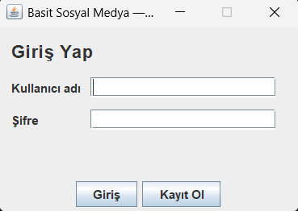
*Login screen — users can sign in or register*

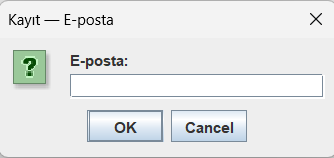
*Email input during registration*

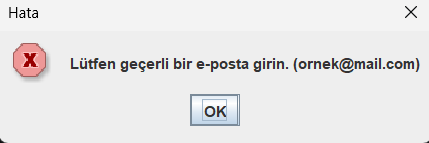
*Invalid email format warning*

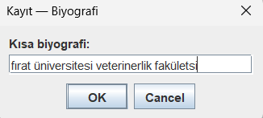
*Biography input during registration*

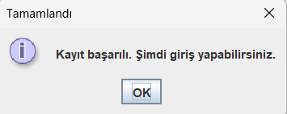
*Successful registration confirmation*

---

### Main Feed
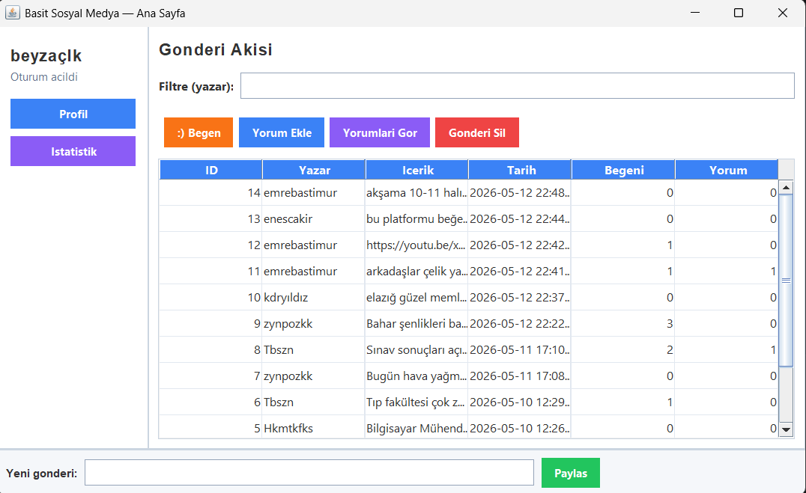
*Main feed — posts sorted by date (newest first) using Bubble Sort*

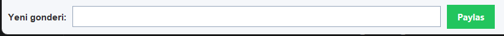
*New post input area at the bottom*

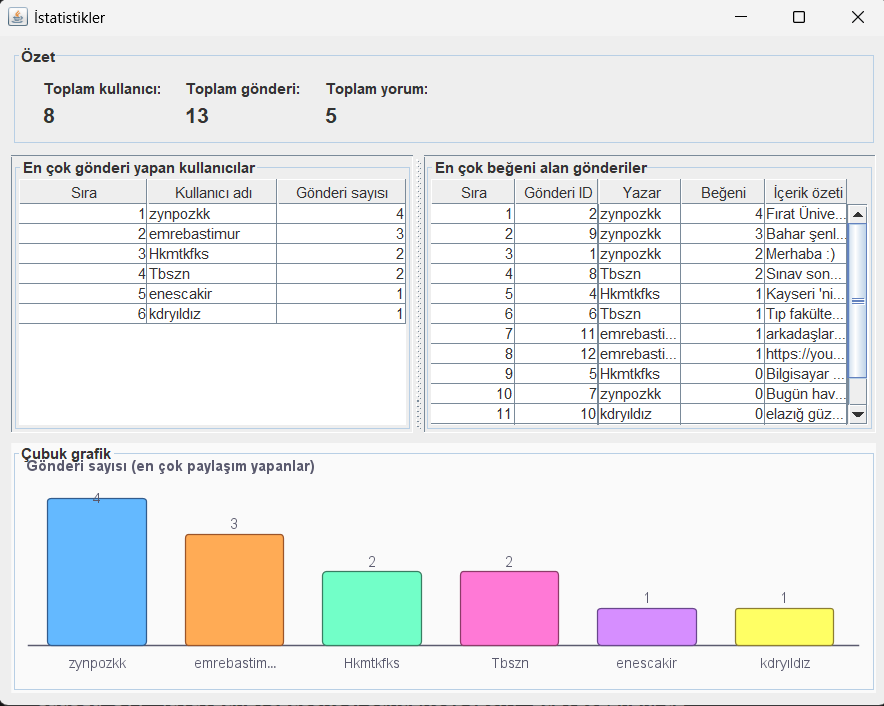
*Real-time filtering by author name*

---

### Post Actions
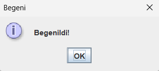
*Like notification*

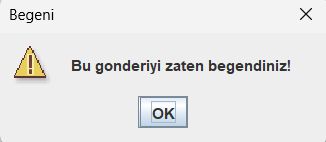
*Warning when trying to like a post twice*

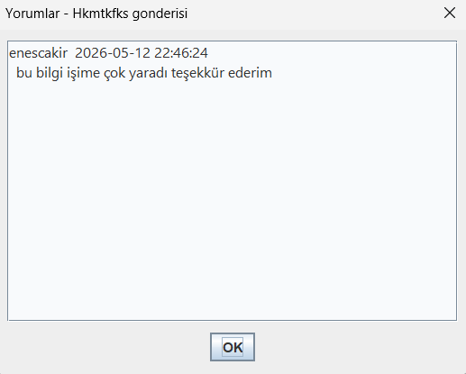
*View comments with username and timestamp*

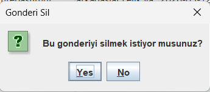
*Delete post confirmation*

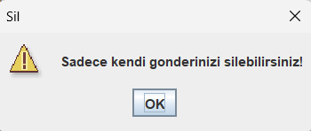
*Warning when trying to delete someone else's post*

---

### Profile
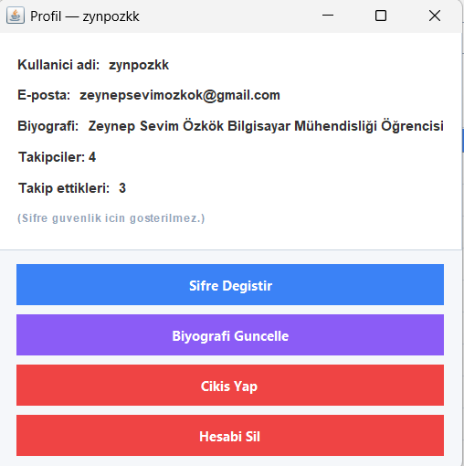
*Own profile — shows followers, following count and action buttons*

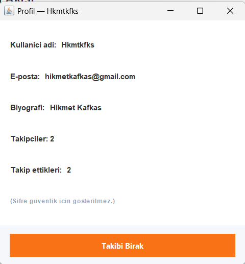
*Other user's profile — Follow/Unfollow button*

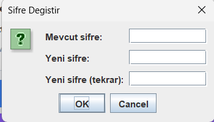
*Change password screen*

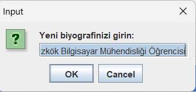
*Update biography*

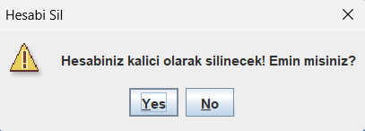
*Logout confirmation*

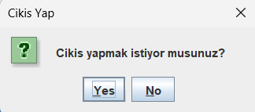
*Delete account confirmation*

---

### Statistics
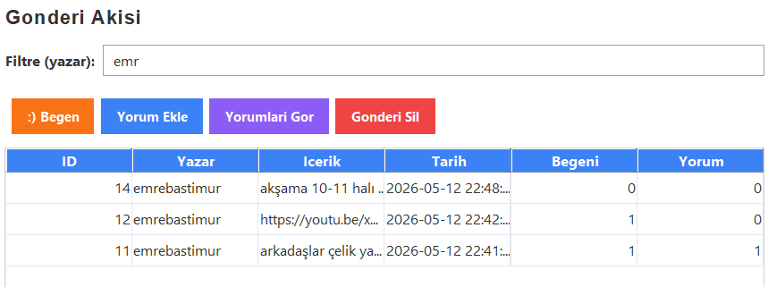
*Statistics screen — top posters, most liked posts and bar chart*

---

## ✨ Features

- User registration and login (with email @ validation)
- Post sharing, sorting (Bubble Sort) and real-time filtering
- Like system (1 like per user per post — permanent)
- Comment system
- Follow / Unfollow system (permanent)
- Profile management (password, biography, delete account)
- Statistics screen with bar chart (Java Graphics2D)
- All data stored in `.txt` files persistently

---

## 🛠️ Tech Stack

| Technology | Usage |
|---|---|
| Java | Core language |
| Java Swing | GUI framework |
| OOP | Encapsulation, Constructor, this keyword |
| ArrayList | Dynamic data structures |
| File I/O | Persistent storage |
| Bubble Sort | Post sorting |
| Graphics2D | Bar chart rendering |

---

## 📁 Project Structure

```
SimpleSocialMedia/
├── src/
│   ├── model/
│   │   ├── Kullanici.java
│   │   ├── Gonderi.java
│   │   └── Yorum.java
│   ├── service/
│   │   └── VeriYoneticisi.java
│   └── gui/
│       ├── LoginEkrani.java
│       ├── AnaSayfa.java
│       ├── ProfilEkrani.java
│       └── IstatistikEkrani.java
└── data/
    ├── kullanicilar.txt
    ├── gonderiler.txt
    ├── takipler.txt
    └── begeniler.txt
```

---

## 🚀 How to Run

**Requirements:** Java JDK 17+

```bash
# Clone the repository
git clone https://github.com/zynpozkk/SimpleSocialMedia.git

# Navigate to src folder
cd SimpleSocialMedia/src

# Compile
javac -encoding UTF-8 model/*.java service/*.java gui/*.java

# Run
java gui.LoginEkrani
```

---

## 📋 Course Requirements

| Requirement | Points | Status |
|---|---|---|
| Program correctness | 30p | ✅ |
| GUI design | 15p | ✅ |
| OOP usage | 20p | ✅ |
| Data structures & algorithms | 20p | ✅ |
| File operations | 10p | ✅ |
| Code readability | 5p | ✅ |
| BONUS: Sorting algorithm | +bonus | ✅ Bubble Sort |
| BONUS: Filtering | +bonus | ✅ Real-time |
| BONUS: Statistics/chart | +bonus | ✅ Graphics2D |
| BONUS: User login system | +bonus | ✅ |

---

## 👩‍💻 Developer

**Zeynep Sevim Özkök** — 235260006  
Fırat University — Computer Engineering — 2025/2026
